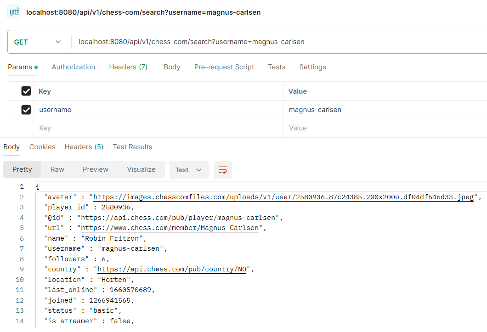
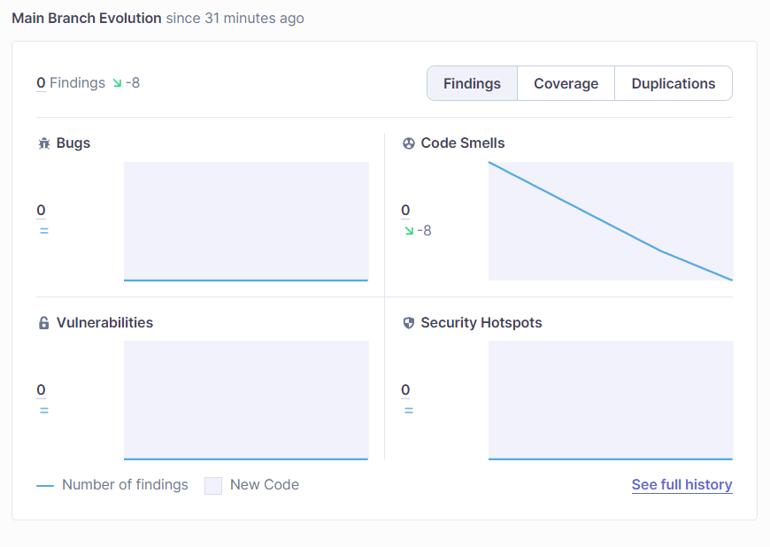

<h1 style="text-align: center">REST Web-service using Chess.com</h1>  

*********************************
### Idea of project
This project contains ENDPOINTS to work with <a style = "text-decoration: underline" href = "https://www.chess.com/news/view/published-data-api">open Chess.com API</a>.
1. <b>First task</b>  
    - Create & start the simplest web / REST service using any open example. Java stack: Spring (Spring Boot) / Maven/ Gradle / Jersey / Spring MVC.   
    - Add GET endpoint accepting input parameters as queryParams in the URL according to the task and returning any hard-coded result as JSON.
2. <b>Second task</b>
    -  Connect database to the project (PostgreSQL/MySQL/и т.д.).  
        - (0 - 7 points) - @OneToMany realization  
        - (8 - 10 points) - @ManyToMany  realization  
    - Realize CRUD-operations with all entities.
   
*********************************
### ENDPOINT LIST (`/database`)

#### Interaction with PLAYERS (`/player`)  
* <b>`GET`</b> `/find_all` — list of players in database
* <b>`GET`</b> `/find?username=USERNAME` — find by `username`
* <b>`POST`</b> `/add` — save player in database. INFO you can find by <a style = "text-decoration: underline" href = "https://api.chess.com/pub/player/u_rich1">`username`</a> using <a style = "text-decoration: none" href = "https://www.chess.com/news/view/published-data-api">open API</a>
* <b>`PATCH`</b> `/update` — update player account in database. You <b>cannot</b> change player ID & username: player is identified by them
* <b>`DELETE`</b> `/delete?username=USERNAME` — delete player account in database by `username`

#### Interaction with GAMES (`/game`)  
* <b>`GET`</b> `/find_all?username=USERNAME` — list of games played by `USERNAME`
* <b>`GET`</b> `/find?uuid=UUID` — find game by `uuid`
* <b>`POST`</b> `/add` — save game in database. You <b>cannot</b> add game between users don't saved before. INFO you can find by <a style = "text-decoration: underline" href = "https://api.chess.com/pub/player/u_rich1/games/2022/12">`username & data`</a> using <a style = "text-decoration: none" href = "https://www.chess.com/news/view/published-data-api">open API</a>
* <b>`PATCH`</b> `/update` — update game info in database. You can change `timestamp & url`
* <b>`DELETE`</b> `/delete?uuid=UUID` — delete game info in database by `uuid`
* <b>`DELETE`</b> `/delete?username=USERNAME` — delete all games in database. Game reviews will be deleted the same

#### Interaction with GAME REVIEWS (`/game_review`)  
* <b>`GET`</b> `/find_all?username=USERNAME` — list of game reviews of player `USERNAME`

This is a service entity used for evaluating player skills. You're <b>not allowed</b> to change something manually, only by adding new games / deleting game exist.
*********************************

*********************************
### Stack of technologies used:  
* Maven
* Spring Web
*********************************

### SonarCloud Results  

